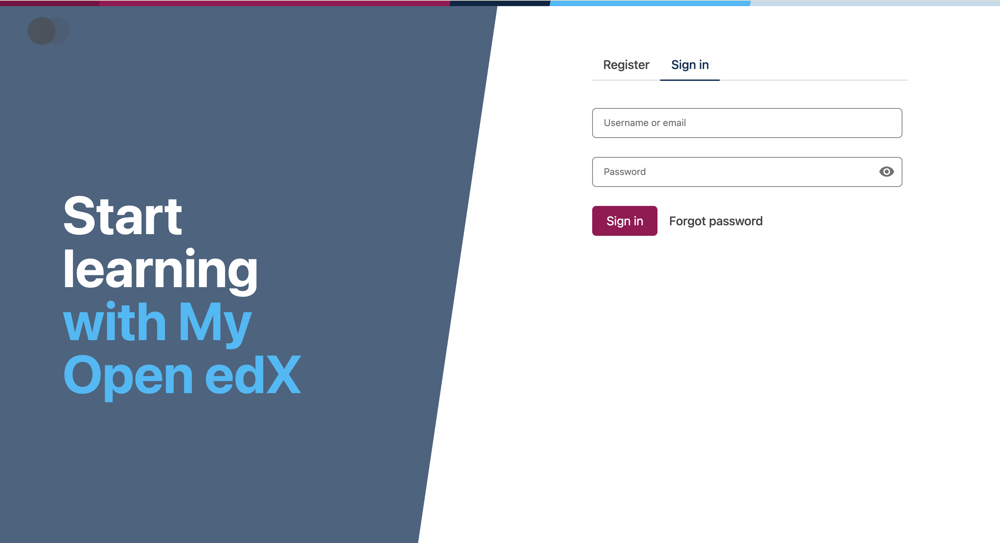
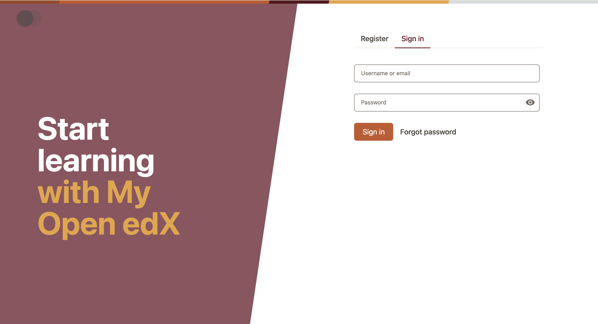

# brand-sample

**This is a simple example brand package that changes the `brand` color to purple.**

### Before


### After


## Using this brand package

Here are 4 different approaches to using this brand package.

> [!IMPORTANT]
> These instructions assume that you have an Open edX environment that supports design tokens:
> * **Paragon >= 23**
> * **Open edX "Teak" release or later**
> * A provisioned Open edX dev environment, either:
>   * **Tutor >= 20**
>   * A "bare-metal" setup

### Local brand dev using Tutor + Tutor Paragon Plugin

This will allow you to hack on the brand, recompile it, and preview it in your local Tutor instance.

First, set up the [Tutor Paragon Plugin](https://github.com/openedx/openedx-tutor-plugins/tree/main/plugins/tutor-contrib-paragon), which will reproducibly compile and serve brands for you:

```bash
# Install and enable the Tutor Paragon plugin.
tutor plugins install https://github.com/openedx/openedx-tutor-plugins/tree/main/plugins/tutor-contrib-paragon
tutor plugins enable paragon

# Build the paragon-builder image.
# With this built, the 'tutor local do paragon-build-tokens' command becomes available.
tutor images build paragon-builder

# Ensure MFE container is running if it isn't already.
# The MFE image will serve the CSS that you compile with paragon-build-tokens.
tutor dev start -d lms cms mfe
```

Every time you edit a theme, copy it into your tutor root and re-run paragon-build-tokens. You can do so by running the following from the root of the sample-plugin repository:

```bash
tutor_root="$(tutor config printroot)"
[ -n "$tutor_root" ] \
  && rm -rf "$tutor_root/env/plugins/paragon/theme-sources/themes" \
  && cp -r brand-sample/tokens/src/themes "$tutor_root/env/plugins/paragon/theme-sources" \
  && tutor local do paragon-build-tokens \
  && echo 'Compiled design tokens :)' \
  || echo 'Could not copy design token sources into tutor environment :('
```

Note: If you are having issues building the tokens, check the contents of the paragon plugin folder within your tutor root. It should look like this:

```bash
tree "$(tutor config printroot)/env/plugins/paragon"
 ├── [...]
 └── theme-sources
     └── themes
         └── light
             └── global
                 └── color.json
```

### Local brand dev without Tutor

TODO write this section

### jsdeliver + Tutor

*tutor-contrib-sample ships with this approach, for your convenience.*

This configures Tutor so that your frontend loads the brand-sample from the [`jsdelivr`](https://www.jsdelivr.com/) CDN. It assumes that the brand exists on GitHub. This does not support local brand development.

Add this to a tutor plugin, and then enable the plugin and restart tutor:

```py
import json
from tutor import hooks

paragon_theme_urls = {
    "variants": {
        "light": {
            "urls": {
                "default": "https://cdn.jsdelivr.net/npm/@openedx/paragon@$paragonVersion/dist/light.min.css",
                "brandOverride": "https://cdn.jsdelivr.net/gh/openedx/sample-plugin@main/brand-sample/dist/light.min.css"
            }
        }
    }
}

fstring = f"""
MFE_CONFIG["PARAGON_THEME_URLS"] = {json.dumps(paragon_theme_urls)}
"""

hooks.Filters.ENV_PATCHES.add_item(
    (
        "mfe-lms-common-settings",
        fstring
    )
)
```

### jsdeliver without Tutor

Within each MFE, configure its `env.config.js` to install this theme:

```js
const config = {
  PARAGON_THEME_URLS: {
    variants: {
      light: {
        urls: {
          "default": "https://cdn.jsdelivr.net/npm/@openedx/paragon@$paragonVersion/dist/light.min.css",
          "brandOverride": "https://cdn.jsdelivr.net/gh/openedx/sample-plugin@main/brand-sample/dist/light.min.css"
        },
      },
    },
  },
};

export default config;
```

If you are running a frontend-base site, configure its `env.config.js` to install this theme:

```tsx
const siteConfig: SiteConfig = {
  [...]
  theme: {
    variants: {
      light: {
        url: 'https://cdn.jsdelivr.net/gh/openedx/sample-plugin@main/brand-sample/dist/light.min.css
      },
    },
  },
  [...]
}
```