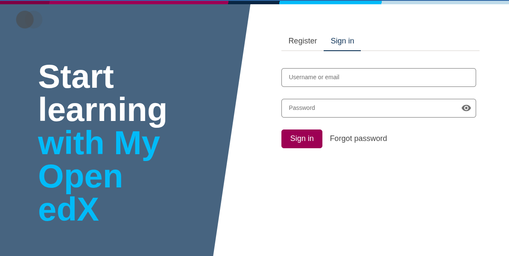
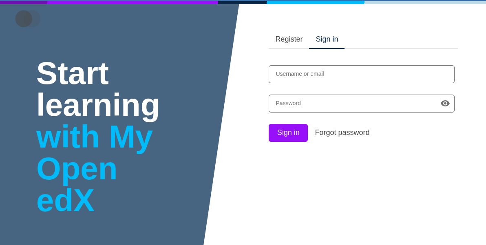

# brand-example-purple

**This is a simple example brand package that changes the `brand` color to purple.**

### Before


### After


## Using this brand package

> [!IMPORTANT]
> These instructions assume you have an environment that supports design tokens
> * **Paragon >= 23**
> * **Open edX "Teak" release (Tutor >= 20)**
> * **Tutor >= 20**

### Configure `tutor` to use this theme

#### Using the [`jsdelivr`](https://www.jsdelivr.com/) CDN (Recommended)

1. Stop `tutor` (`tutor dev stop` or `tutor local stop`)
2. Navigate to your local tutor plugins directory (`tutor plugins printroot`)
3. Create a new `purple-jsdelivr.py` plugin file with the following content

```py
import json
from tutor import hooks

paragon_theme_urls = {
    "variants": {
        "light": {
            "urls": {
                "default": "https://cdn.jsdelivr.net/npm/@openedx/paragon@$paragonVersion/dist/light.min.css",
                "brandOverride": "https://cdn.jsdelivr.net/gh/openedx/sample-plugin@main/brand/dist/light.min.css"
            }
        }
    }
}

fstring = f"""
MFE_CONFIG["PARAGON_THEME_URLS"] = {json.dumps(paragon_theme_urls)}
"""

hooks.Filters.ENV_PATCHES.add_item(
    (
        "mfe-lms-common-settings",
        fstring
    )
)
```

4. Enable the plugin (`tutor plugins enable purple-jsdelivr`)
5. Start `tutor`  (`tutor dev start lms cms mfe` or `tutor local start lms cms mfe`)

#### Using the [Tutor Paragon Plugin](https://github.com/openedx/openedx-tutor-plugins/tree/main/plugins/tutor-contrib-paragon) (Recommended)

1. [Install](https://github.com/openedx/openedx-tutor-plugins/tree/main/plugins/tutor-contrib-paragon#installation) and [enable](https://github.com/openedx/openedx-tutor-plugins/tree/main/plugins/tutor-contrib-paragon#enable-the-plugin) the Tutor Paragon Plugin (`tutor-contrib-paragon`)
2. [Build](https://github.com/openedx/openedx-tutor-plugins/tree/main/plugins/tutor-contrib-paragon#build-the-paragon-image) the `paragon-builder` image.
2. Navigate to your Tutor config directory (you can find this by running `tutor config printroot`)
3. From your config directory, navigate to `env/plugins/paragon` (the full path on my dev machine is `~/.local/share/tutor-main/env/plugins/paragon`)
4. You should see some directories in there, find the `theme-sources` directory.
5. Place this theme's [`color.json` file](./src/tokens/src/themes/light/global/color.json) in the appropriate subdirectory of the `theme-sources` directory.
```sh
$ tree ~/.local/share/tutor-main/env/plugins/paragon
├── [...]
└── theme-sources
    └── themes
        └── light
            └── global
                └── color.json
```
6. [Build](https://github.com/openedx/openedx-tutor-plugins/tree/main/plugins/tutor-contrib-paragon#build-all-themes) the theme
7. Start `tutor`  (`tutor dev start lms cms mfe` or `tutor local start lms cms mfe`)
